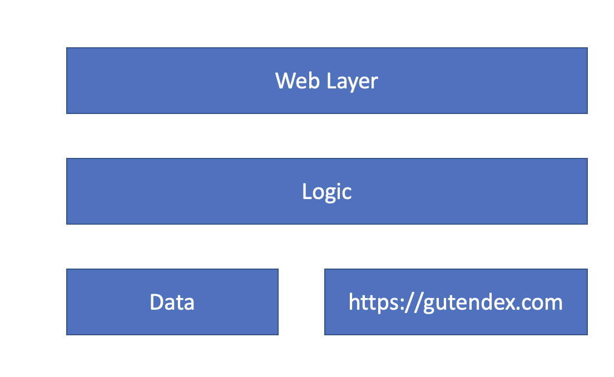

<b> <u>Moro-Tech Software Engineering Challenge </u></b>

The implemented solution extends the <a href="https://gutendex.com/">https://gutendex.com</a> by adding comments and ratings per book.
The user is now able to rate a book and get the average rating of an existing book as long as searching and getting the top N rated books.

The solution follows the Restful aspects. The architecture is based on N-tier concept



The Web Layer is implemented by classes:
<li>BooksController.java</li>

The Logic is implemented by classes:
<li>BooksRatingService.java</li>
<li>BooksService.java</li>

The solution can be executed in following environments:
<li>InteliJ for local development</li>
<li>Can be installed using Docker containers</li>
<li>Is already installed in Azure Virtual Machine</li>

<b>Local Development</b>

application.yml configuration is used for local development.
```yaml
    server:
    port: 8060
    shutdown: GRACEFUL
    spring:
      profiles:
        active: dev
      application:
        name: edi-masterdata-retrieve-service
      datasource:
        url: jdbc:sqlite:/Books.db # replace it with the sqlite .db file in your local machine
        driver-class-name: org.sqlite.JDBC
      sql:
        init:
          schema-locations: classpath:schema.sql
          mode: always
    config:
      gutendex-url: https://gutendex.com/books/
      moro-book-service-url: http://localhost:8060/v1/books/
```

<b>Docker Installation</b>

docker-compose.yml configuration is used for docker container installation.
```yaml
version: '3'

services:
  MoroBooks:
    build: .
    image: moro-books:latest
    restart: unless-stopped
    container_name: moro-books-service
    environment:
      - spring.config.use-legacy-processing=true
      - spring.profiles.active=prod
      - spring.datasource.url=jdbc:sqlite:/home/sqlite/db/Books.db
      - config.moro-book-service-url=http://localhost:8081/v1/books/ #this needs to be replaced with the public ip and assigned port.
    volumes:
      - ./project/deployements/db/:/home/sqlite/db  #replace ./project/deployments/db/ with the actual path in the docker host machine.
    ports:
      - 8081:8081/tcp
```
Commands to install the application in Docker Daemon after modifying the docker-compose.yml accordingly.
```cmd
docker-compose build
docker-compose up
```
<b>Live environment</b>

The solution is deployed as Docker image in Azure VM and is accessible through public ip

<b>Solution scaling</b>

The solution is designed as a microservice running individually in docker container after image build.
For proper scale out horizontally by deploying the image into a container orchestrator like Kubernetes.

